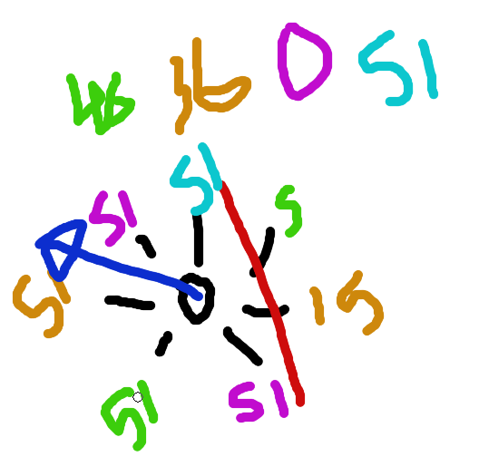

# tareas 1 de mayo
JESUS
implementar codigo de ultrasonicos en el complete, poner de rango (-180, 180) siendo 0 el angulo de enfrente, esto para hacer menos calculos en la raspberry, enviar componente en x, y, magnitud y angulo del vector resultante.
40 MIN

Implementar el codigo del sensor laser en el complete.
30 MIN

Codificar el detectamiento de atascamiento.
40 MIN

Implementar el codigo de atascamiento en complete.
30MIN

FRANCISCO
Terminar tabla de reparaciones.
40 MIN

Hacer cableado de lo que falte.
30-40 MIN

JUANA
Ensamblaje de garra
40 MIN

Prueba de rangos de servos
20 MIN

TODOS
preparar scripts de movimientos indivivuales, (recoger latas, depositar latas)

hacer base de codigo en python para llamar los switches desde raspberry y no arduino

# TMR2022_arduino
Codigo para codigos de control y prueba del TMR2022.

## TODO:
- [ ] Codigo completo (leer).
- [ ] Implementar logica de vectores de ultrasonicos para deteccion de colisiones en Python. 
- [ ] MPU9050 (acelerometro, giroscopio) leer y checar deteccion de estancamiendo.
- [ ] ModuloGPS (GPS) leer y checar deteccion de estancamiendo.

## Descipcion de programas
-------
| Archivo | Descripcion | 
|---|---|
| CompleteTMR2022 | Programa completo que se usara en la competencia, debe ser el mas completo y probablemente contenga a los demas archivos dentro. |
| moveServoToPos | Programa que mueve el servo a una posicion determinada en la terminal de serial. |
| move_2_servos_to_pos | Programa que mueve 2 servos a una posicion determinada en la terminal de serial. |
| PruebaServosGarra | Programa que subira y bajara los motores en intervalos de tiempo para probar la funcionalidad de los servos |
| PruebaUltrasonicos | Programa que mostrara en serial los valores de ultrasonicos |
| PruebaMPU9050 | Programa que mostrara en serial los valores de aceleracion y giroscopio |
| PruebaGPS | Programa que mostrara en serial los valores de GPS |
| VectoresUltrasonicos | Programa que implementara la logica de los vectores de ultrasonicos |
